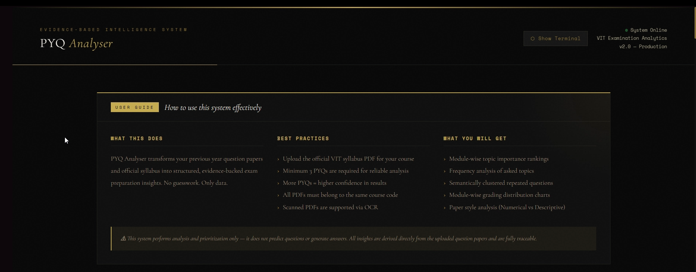

# PYQ Analyser
**Automated Question Paper Parsing and Pattern Mining**

> PYQ Analyser converts previous year question papers into structured, syllabus-aligned insights that help students prepare smarter.

---

## Demo & Results Preview

<p align="center">
  <a href="https://youtu.be/DIu8z9ix4_o">
    
  </a>
</p>

<p align="center">
  Click the image to watch the project demo
</p>

---

## 📄 Sample Output

<p align="center">
  <a href="docs/sample_output.pdf" download>
    
  </a>
</p>

---

## Why This Project Was Built (The Problem)

Preparing for university exams is often inefficient. Students usually have two main resources:
1. Official syllabus
2. Previous Year Question Papers (PYQs)

Even though students have access to these, there is no structured way to analyze them together. As a result, students rely on guesswork, peer suggestions, or random topic prioritization, leading them to:
* Study the entire syllabus blindly.
* Miss frequently asked topics.
* Waste time on low-impact areas.
* Feel uncertainty before exams.

I wanted to build a transparent, explainable system (not a black-box AI) that answers:
* *Which topics appear most often in exams?*
* *Which modules carry the highest marks?*
* *Which questions repeat frequently?*
* *What is the style of the exam?*

---

## What This System Does

The system analyzes multiple previous year papers and generates evidence-based exam insights:
* **Module-wise topic importance**
* **Frequently asked topics**
* **Repeated canonical questions**
* **Module-wise grading distribution**
* **Question style distribution** (numerical vs descriptive vs analytical)

*Note: The goal is not to predict questions, but to provide evidence-based preparation guidance.*

---

## Key Capabilities

### 1. Automatic Question Extraction
The system accepts PDF question papers (including scanned documents) and performs:
* OCR extraction
* Question reconstruction
* Mark inference
* Structured JSON generation

### 2. Syllabus-Constrained Topic Mapping
Each extracted question is strictly mapped to official syllabus topics using:
* Semantic embeddings (`all-MiniLM-L6-v2`)
* Concept overlap scoring
* Fuzzy matching
* Hierarchical module selection

**Current Mapping Accuracy:** ~90% accuracy (module level) | ~85% accuracy (topic level).

### 3. Evidence-Based Topic Importance
Topics are ranked based on frequency of occurrence and marks contribution. Each topic includes evidence references to actual exam questions.

**Importance Score Formula:**
```text
importance_score = (frequency_weight * normalized_frequency) + (marks_weight * normalized_marks)
```
*(Default weights: frequency_weight = 0.6, marks_weight = 0.4)*

### 4. Canonical Question Detection
Using embedding similarity and clustering, the system identifies questions that are repeatedly asked in different wording and tracks their occurrences across papers.

### 5. Question Style Analysis
Identifies exam style patterns by classifying questions into categories such as:
* Numerical
* Descriptive
* Analytical
* Diagrammatic

### 6. Module-Wise Grading Distribution
Computes how marks are distributed across modules historically to answer: *Which modules carry the most marks?*

---


> 🔬 **Curious about the internals?** Scroll down to the [**Technical Deep Dive**](#-technical-deep-dive--how-it-actually-works) section for a detailed breakdown of every component, every design decision, and how all the pieces fit together.

---

## Challenges Faced During Development

* **OCR Noise:** Scanned PDFs produce messy text. Solved via OCR normalization, duplicate removal, question reconstruction logic, and sub-question handling.
* **Question Structure Recovery:** Exam papers have inconsistent formats. The system had to reconstruct question numbers, sub-questions, marks, and question boundaries.
* **Accurate Topic Mapping:** Simple keyword matching fails. Solved by combining semantic embeddings, concept overlap scoring, fuzzy token matching, and hierarchical module filtering.
* **Preventing Topic Hallucination:** A key design rule — the system must never invent new topics. All mappings are constrained strictly to the syllabus.

---

## System Architecture

The system follows a pipeline-based architecture:

```text
Syllabus PDF ─────────┐
                      ▼
             Syllabus Extraction
                      │
                      ▼
Question Paper OCR ───┤
                      ▼
            Question Reconstruction
                      │
                      ▼
         JSON Cleaning & Normalization
                      │
                      ▼
             Topic Mapping Engine
                      │
                      ▼
             Analytics Generation
```

### Project Structure
```text
project/
├── backend/
│   ├── main.py
│   ├── pipeline_runner.py
│   └── job_manager.py
├── frontend/
│   └── templates/
│       └── index.html
├── analytics/
│   ├── canonical_engine.py
│   ├── config.py
│   ├── data_loader.py
│   ├── embedding_engine.py
│   ├── grading_engine.py
│   ├── importance_engine.py
│   ├── module_filter.py
│   ├── run_analytics.py
│   ├── style_engine.py
│   ├── subject_gate.py
│   ├── syllabus_enrichment.py
│   ├── text_utils.py
│   └── topic_mapper.py
└── modules/
    ├── course_check.py
    ├── json_cleaning.py
    ├── question_extractor.py
    ├── syllabus_extract.py
    └── text_extract.py
```

## 🔬 Technical Deep Dive — How It Actually Works

This section documents the internal design of PYQ Analyser in full detail — every engine, every decision, and the reasoning behind the architecture. This is intended for developers, researchers, or anyone who wants to understand, extend, or reproduce the system.

---

### Stage 1 — Syllabus Ingestion (`syllabus_extract.py`)

The pipeline starts with the official VIT syllabus PDF. Rather than treating the syllabus as a flat document, the system extracts its structured module hierarchy: module IDs, module names, and the list of topics within each module.

**How it works:**

The PDF is parsed using `PyMuPDF (fitz)`, which extracts raw text page by page. The raw text is then truncated at the first occurrence of "Text Book" to strip out references and appendices, ensuring only the core syllabus body is processed.

Topic boundaries are identified using a custom regex-based delimiter engine that recognizes both em-dashes and commas as topic separators. Each topic string is then normalized — stripping hour markers, leading/trailing punctuation, and deduplicating entries while preserving original order.

**Course code extraction** uses a two-pass regex strategy. The first pass targets table-structured syllabi (where course code and title appear on separate lines). The second pass falls back to an inline pattern for compact syllabus formats. The extracted course code is normalized to remove all whitespace, producing a clean identifier like `BECE301L`.

The output is a structured JSON file:
```json
{
  "course_code": "BECE301L",
  "course_title": "Digital Electronics",
  "modules": [
    {
      "module_id": 1,
      "module_name": "Number Systems and Boolean Algebra",
      "topics": ["Number Systems", "Boolean Algebra", "Karnaugh Maps", ...]
    }
  ]
}
```

---

### Stage 2 — Syllabus Enrichment with Ollama (`syllabus_enrichment.py`)

The raw syllabus topics are a flat list. This is not rich enough for accurate semantic mapping — a flat list loses the hierarchical relationships between concepts. Stage 2 transforms the flat list into a structured two-level hierarchy using a locally running LLM via **Ollama**.

**Why Ollama?**

Ollama was chosen to run the `qwen2.5:7b` model locally without any external API dependency. This is critical for a system designed to run on a student's laptop with potentially no internet access, and eliminates concerns about API cost and data privacy for uploaded exam papers.

**What the LLM does:**

Each module's flat topic list is sent to `qwen2.5:7b` with a tightly constrained system prompt. The LLM is instructed to:
- Decide which topics are "main topics" and which are naturally subordinate sub-topics of a preceding topic
- Write a two-line description for each main topic, strictly within the context of the syllabus (no hallucination)
- Append known acronyms to topic names (e.g., "Fast Fourier Transform (FFT)")
- Maintain strict ordering — a topic can only become a sub-topic of a topic that precedes it in the original list
- Return strictly valid JSON with no markdown wrappers

The prompt was engineered over many iterations with explicit rules to prevent the LLM from:
- Inventing topics not in the original list
- Skipping topics
- Creating more than one level of hierarchy
- Using creative or generalized interpretations

**Caching:** Once an enriched syllabus is generated for a course code, it is saved to disk and reused on subsequent runs. This means the expensive LLM call only happens once per course.

The output is a structured enriched syllabus where each module now contains `main_topics` with optional `sub_topics` and descriptions:
```json
{
  "main_topics": [
    {
      "main_topic": "Karnaugh Maps (K-Map)",
      "sub_topics": ["Two-variable K-Map", "Three-variable K-Map", "Don't Care conditions"],
      "desc": "A graphical method for simplifying Boolean expressions by grouping adjacent minterms to minimize logic functions."
    }
  ]
}
```

---

### Stage 3 — OCR and Question Paper Ingestion (`text_extract.py`)

Scanned exam paper PDFs are processed using **Tesseract OCR** via `pytesseract`, with PDF-to-image conversion handled by `pdf2image` (backed by Poppler).

Each PDF page is converted to a 300 DPI image before being passed to Tesseract with `--psm 6` (uniform block of text mode), which works well for structured exam paper layouts. All pages are concatenated and normalized — collapsing excess blank lines, stripping trailing whitespace — into a clean `.txt` file per paper.

**Design note on DPI:** 300 DPI was chosen deliberately. Higher DPI (e.g., 600 DPI) produces sharper images but can exceed PIL's `DecompressionBombError` threshold on A4 paper. The system detects and raises a human-readable error in this case, prompting the user to re-export at 300 DPI.

---

### Stage 4 — Subject Gate (`course_check.py`)

Before any question extraction is attempted, every uploaded paper is validated against the syllabus course code. This prevents the analytics from being contaminated by papers from a different subject.

**How it works:**

The first 500 characters of each paper's OCR text (the header region, which typically contains the course code and title) are sent to `qwen2.5:7b` with a strict information extraction prompt. The LLM returns only the detected course code and course title as JSON.

A two-stage fallback handles imperfect OCR:
1. If the code is detected but the title is missing, the title is filled from a local `course_mapping.json` lookup table.
2. If the title is detected but the code is missing, all matching codes are looked up from the mapping table. If multiple matches exist, the syllabus code is used to disambiguate.

Only papers whose detected course code matches the syllabus code exactly proceed to extraction. Invalid papers are reported clearly in the UI.

---

### Stage 5 — Question Extraction (`question_extractor.py`)

Each validated OCR text file is sent to `qwen2.5:7b` for structured question extraction. The LLM is prompted to reconstruct the full exam paper into a normalized JSON format, handling:

- Main question numbers and their text
- Sub-question labels `(a)`, `(b)`, `(i)`, `(ii)` etc. in any format
- Mark allocation at both main and sub-question levels
- A key structural rule: if sub-questions exist, the `question_text` field of the main question must contain **only** the shared introductory stem — sub-question content must not be duplicated into the main text
- Mark inference: if marks appear next to sub-questions, the main question mark is computed as the sum; if marks cannot be derived, they are set to `null` rather than hallucinated

The prompt explicitly instructs the model to ignore OCR garbage, page headers, instructions, and watermarks.

---

### Stage 6 — JSON Cleaning and Mark Normalization (`json_cleaning.py`)

Raw LLM extraction output is structurally inconsistent across papers. This stage applies a deterministic post-processing pipeline to normalize every paper into a clean, analytically reliable format.

**Structural repairs:**
- Empty sub-questions are removed
- Single sub-questions are collapsed into the main question
- Text duplicated between main question and sub-questions is de-duplicated
- Duplicate question numbers are resolved by auto-incrementing from the current maximum

**Mark normalization:**

The mark engine first infers whether a paper is a 50-mark or 100-mark paper based on question count (threshold: 7 questions). It then applies two-pass normalization:

1. **Global pass:** If more than 40% of marks are `null`, equal distribution is applied across all questions. Otherwise, `null` marks are filled proportionally from the remaining mark budget.
2. **Sub-question pass:** Any sub-question with a `null` or zero mark is assigned a default of 5 marks, and the parent question's mark is recomputed as the sum of its sub-questions.

This ensures the analytics engine always has complete mark data to work with, without fabricating values that conflict with explicit marks in the paper.

---

### Stage 7 — Topic Mapping Engine (`topic_mapper.py`)

This is the most technically complex component in the system. Each extracted question must be mapped to the official syllabus topics it tests. Simple keyword matching fails here because:
- Questions use domain language that differs from syllabus topic names
- Acronyms are used inconsistently
- A question can legitimately span multiple topics

The mapping engine uses a **three-signal hybrid scoring** approach.

**Signal 1 — Semantic Similarity (weight: 0.50)**

Questions and topics are both encoded as dense vector embeddings using `sentence-transformers` with the `all-MiniLM-L6-v2` model. This 384-dimension model was selected for its strong balance of accuracy and inference speed — it runs comfortably on CPU with no GPU required.

Cosine similarity between the question embedding and each topic embedding is computed via `numpy` dot products (embeddings are L2-normalized by the engine). A minimum semantic floor of `0.20` filters out completely unrelated topics.

**Signal 2 — Concept Overlap (weight: 0.40)**

Each question and topic is tokenized by a custom tokenizer that strips stopwords and applies lightweight stemming (removing trailing 's'). The concept score is the Jaccard-style overlap between the question's token set and the topic's token set:

```text
concept_score = |topic_tokens ∩ question_tokens| / |topic_tokens|
```

This signal heavily rewards questions that directly name the topic's key concepts.

**Signal 3 — Fuzzy Token Matching (weight: 0.10)**

`rapidfuzz.fuzz.token_set_ratio` provides a character-level fuzzy match score, catching OCR errors and minor spelling variants.

**Hierarchical Module Pre-filtering:**

Before topic scoring, a module-level pre-selection is performed. The question embedding is compared against module-level embeddings (constructed from the module name and all its topics). Only topics from the top-scoring module(s) — within a 0.05 similarity margin of the best module — are scored. This prevents cross-module false positives and is the primary reason for the ~90% module-level accuracy.

**Acronym Expansion:**

Before encoding, all questions are run through an acronym expansion pass. The enriched syllabus is scanned for explicit acronyms in parentheses and for capitalized multi-word topic names whose initials form a known acronym. When an acronym is detected in a question, it is expanded inline (e.g., "FFT" → "FFT (Fast Fourier Transform)") before embedding, significantly improving semantic recall.

**Mark Allocation:**

When a question maps to multiple topics, its marks are split equally across them. This proportional allocation feeds into the importance score computation downstream.

**Fallback:**

If no topic reaches the minimum scoring threshold, the question is assigned to a "Module-Level Fallback" pseudo-topic under the top-scoring module. Fallback questions are excluded from topic-level analytics but are retained in the dataset for grading distribution calculations.

---

### Stage 8 — Analytics Engines

#### Topic Importance (`importance_engine.py`)

For each topic, two raw metrics are computed across all mapped questions:
- **Frequency:** the total number of times the topic has been tested
- **Total Marks:** the sum of allocated marks for all questions mapped to the topic

Both are normalized within their module (max-normalization) and combined into a single importance score using configurable weights (default: 60% frequency, 40% marks). This formula intentionally weights frequency higher, because a topic asked many times for few marks is more strategically important to study than a topic that appeared once for high marks.

Each topic entry also carries an **evidence list** — the exact paper names and question numbers that contributed to its score, making every ranking traceable and explainable.

#### Canonical Question Detection (`canonical_engine.py`)

This engine identifies questions that are semantically equivalent — the same concept tested in different words across different years.

Questions are grouped by their mapped topic. Within each topic group, all question texts are embedded and pairwise cosine distances are computed. **Agglomerative Clustering** with average linkage is applied with a distance threshold of `0.55` (equivalent to a similarity threshold of ~0.45). This choice of linkage ensures all members of a cluster are mutually close, not just close to a single centroid.

Clusters with fewer than two members are discarded (no repetition). For qualifying clusters, the **medoid** — the question with the smallest total distance to all other cluster members — is selected as the canonical representative. This is more robust than a centroid because it always returns an actual question from the dataset.

The output reports each canonical question, how many times it has appeared, and the exact papers and question numbers it was drawn from.

#### Grading Distribution (`grading_engine.py`)

For each paper, the allocated marks for each module are summed and expressed as a percentage of the paper's total marks. A combined average distribution is also computed across all papers. This answers: *historically, what fraction of the exam comes from each module?*

#### Question Style Analysis (`style_engine.py`)

Questions are classified into style categories (Numerical, Descriptive, Diagrammatic, Analytical) using a multi-signal local classifier — no LLM required.

The classifier uses `spaCy`'s `en_core_web_sm` model to parse each question and extract the dependency root verb. Root verbs are matched against curated action verb sets (e.g., `{"calculate", "compute", "derive"}` → Numerical; `{"explain", "describe", "define"}` → Descriptive). Named entity types are also used as secondary signals.

A custom **symbol density function** quantifies the concentration of mathematical operators, brackets, and unit strings (e.g., `kg`, `hz`, `mv`) relative to word count. High symbol density is a strong Numerical indicator. A hybrid "Applied/Numerical" category is assigned when both analytical intent and high math density are detected simultaneously.

---

### Async Job System (`job_manager.py`, `main.py`)

The full analysis pipeline — OCR, LLM inference, embedding, clustering — can take 2–5 minutes for a typical set of papers. To keep the UI responsive, the pipeline runs in a **background thread** managed by a lightweight in-memory job system.

When the frontend triggers analysis, the backend immediately returns a `job_id`. The frontend polls `/job-status/{job_id}` every 2 seconds. The job object carries a `logs` list (appended to by the pipeline), a `status` field (`running` / `completed` / `error`), and the final `result` payload. Log entries are streamed to the terminal UI in real time.

---

### Frontend Architecture (`index.html`)

The entire frontend is a single self-contained HTML file with no framework dependencies. It uses vanilla JavaScript with `Chart.js` for grading and style distribution charts, `html2canvas` + `jsPDF` for PDF report generation, and a custom terminal widget that streams live backend logs.

The terminal supports drag-to-resize, minimize/expand, and a stop-and-reset function that calls `/cleanup` on the backend to purge all intermediate files (uploaded PDFs, OCR text, structured JSON, cleaned JSON) while preserving the enriched syllabus cache for reuse.

---

### Design Philosophy

Several deliberate decisions shaped the architecture:

| Decision | Rationale |
|---|---|
| Local LLM via Ollama | No API cost, no data privacy concerns, works offline |
| Separate enrichment stage | Flat syllabus topics alone are insufficient for accurate mapping; hierarchy and descriptions add semantic richness |
| Hybrid 3-signal topic mapper | Semantic alone misses exact concept matches; concept overlap alone misses paraphrased questions; both are needed |
| Agglomerative over K-Means clustering | Number of canonical clusters is unknown in advance; agglomerative with a distance threshold discovers it automatically |
| Medoid over centroid for canonical rep | Medoid always returns a real question; centroid would produce a synthetic average vector |
| Proportional mark splitting | A question spanning two topics contributes half its marks to each — importance scores reflect actual exam weight |
| Evidence references on every output | Every ranking is traceable to source papers — the system is explainable, not a black box |

---

## Installation & Usage

### 1. Clone the Repository
```bash
git clone https://github.com/yourusername/pyq-analyser.git
cd pyq-analyser
```

### 2. Create Virtual Environment

**Windows:**
```cmd
python -m venv venv
venv\Scripts\activate
```

**Mac / Linux:**
```bash
python3 -m venv venv
source venv/bin/activate
```

### 3. Install Dependencies
```bash
pip install -r requirements.txt
```

### 4. Install and Start Ollama

The system requires [Ollama](https://ollama.com) running locally with the `qwen2.5:7b` model. Ollama is used for three tasks: subject gate validation, question extraction, and syllabus enrichment.

```bash
# Install Ollama from https://ollama.com/download
# Then pull the required model:
ollama pull qwen2.5:7b

# Start the Ollama server (runs on localhost:11434 by default):
ollama serve
```

> **Why Ollama?** Running `qwen2.5:7b` locally means your exam papers never leave your machine, there are no API costs, and the system works fully offline once the model is downloaded.

### 5. Install System Dependencies

**Tesseract OCR** and **Poppler** are required for PDF processing:

**Windows:**
- Download Tesseract from [UB Mannheim](https://github.com/UB-Mannheim/tesseract/wiki) and install to `C:\Program Files\Tesseract-OCR\`
- Download Poppler from [oschwartz10612](https://github.com/oschwartz10612/poppler-windows/releases) and extract to `C:\poppler\`

**Mac:**
```bash
brew install tesseract poppler
```

**Linux:**
```bash
sudo apt-get install tesseract-ocr poppler-utils
```

### 6. Running the System
Start the FastAPI server:
```bash
python backend/main.py
```
Open the interface in your browser.

**The Workflow:**
1. Upload syllabus PDF.
2. Upload at least 3 previous year papers.
3. Select module range.
4. Run analysis.

---

## Example Output Insights

The system generates analytics outputs (backed with exact question references) that answer:
* Which topics appear most frequently in Module 3?
* Which questions repeat across multiple years?
* What percentage of the exam is numerical?
* Which modules carry the highest marks historically?

---

## Future Directions

This project currently focuses on VIT-style syllabus structures, but the long-term goal is to evolve it into a broader, reusable academic analytics platform. Future plans include:
* Converting the system into a full web application.
* Supporting multiple universities and syllabus formats.
* Allowing automatic PYQ dataset ingestion.

---

## Project Status

**Current implementation includes:**
* Full analytics pipeline
* Topic mapping engine
* Canonical question detection
* FastAPI backend
* Web interface

*Further improvements will focus on scalability, UI enhancements, and multi-institution support.*
